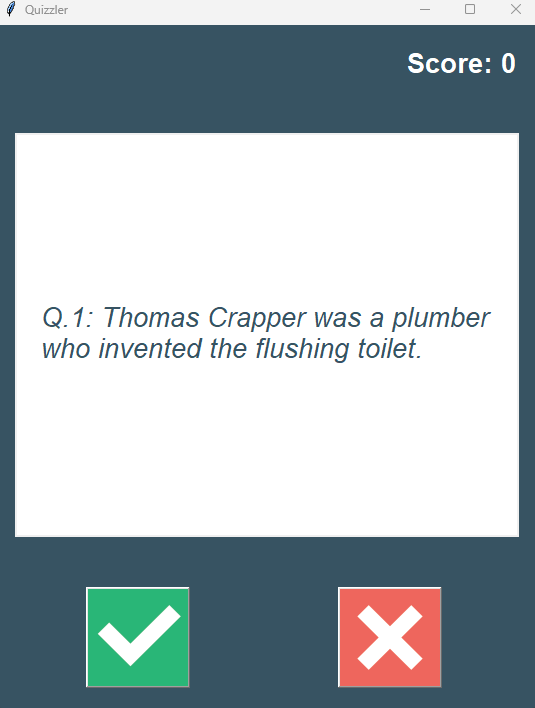

# QuizBrain

## Overview
Hello! I'm Mert, and on Day 17 of my "100 Days of Python" challenge, I'm excited to share the "Quiz Program." This Python application lets users take a quiz, answering a series of questions and receiving a final score. It serves as a practical project to reinforce Python programming concepts and interactive user input handling.

## Required Files and Libraries
To run this quiz program, you will need the following files:

* question_model.py: Defines the Question class, representing a quiz question.
* data.py: Contains the question_data list with quiz questions and answers.
* quiz_brain.py: Implements the QuizBrain class responsible for managing the quiz flow.
* main.py: The main Python script to run the quiz program.
### Python Libraries:
This program uses built-in Python libraries such as input for user interaction.

Please ensure these files are in the same directory before running the program.

### Educational Objectives:
This project is designed to apply various Python concepts and functions, including:

* Class Definitions: Creating and utilizing classes, such as the Question class for representing quiz questions and the QuizBrain class for managing the quiz.
* Lists and Dictionaries: Storing and accessing data using lists and dictionaries, as seen in the question_data list and the MENU dictionary.
* Loops and Conditionals: Implementing for and while loops, as well as if/else statements to control the quiz flow based on user input.
* User Input Handling: Utilizing the input function to collect user responses and validate answers.
* Modularity: Breaking down the program into smaller, manageable classes and functions to enhance code organization and readability.
### Key Features
* Quiz Questions: Displays a series of questions for users to answer.
* Score Tracking: Calculates and displays the user's final score.
* User Interaction: Engages users with interactive questions and input prompts.
* Educational Tool: Provides a hands-on experience for practicing Python concepts in a quiz format.
### Invitation to Participate
The Quiz Program is an engaging way to reinforce your Python programming skills. Feel free to explore the code, customize quiz questions, or even extend the program with additional features. Enjoy the learning journey, and test your Python knowledge with this interactive quiz!

## Update
### Version 1.1 (Day 17 Update)
* Updated on Day 34th Code Challange 
#### Added Features:
1. **Enhanced User Interaction:** Improved the user experience with more informative prompts and responses.
2. **Question Randomization:** Implemented randomization of quiz questions for a dynamic quiz-taking experience.

#### Code Refinements:
1. **Optimized Input Handling:** Streamlined user input validation and improved error handling for a smoother interaction.
2. **Efficient Data Management:** Introduced optimizations in the management of question data for better performance.

#### Bug Fixes:
1. **Resolved Display Issues:** Fixed minor display inconsistencies to ensure a polished and cohesive quiz interface.
2. **Improved Score Calculation:** Addressed a bug related to score calculation, ensuring accurate final scores.

### How to Update:
To incorporate the latest changes and improvements, follow these steps:
1. Download the updated version of the main.py script from the repository.
2. Replace the existing main.py file in your local environment with the new one.

Feel free to explore the updated features and provide feedback. Happy coding!
